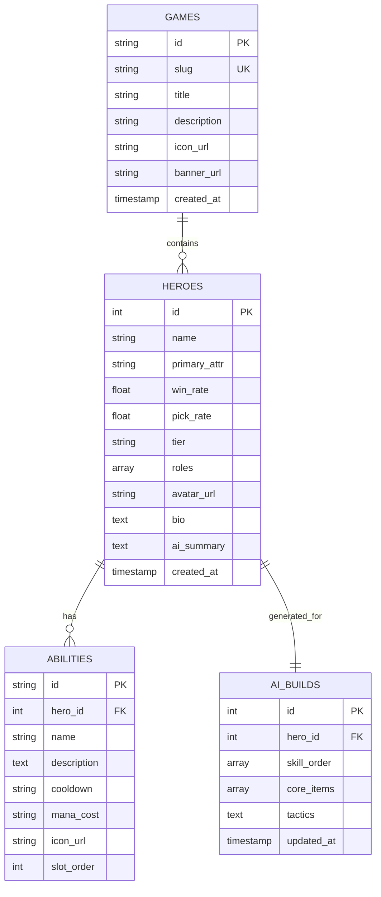

# Схема Бази Даних (ERD) - Kakatone Dota Guide

Документ для розробника **Бекенд (База даних - YY)**.

## Діаграма зв'язків сутностей (Mermaid ERD)

```mermaid
erDiagram
    GAMES ||--o{ HEROES : contains
    HEROES ||--o{ ABILITIES : has
    HEROES ||--|| AI_BUILDS : generated_for

    GAMES {
        string id PK
        string slug UK
        string title
        string description
        string icon_url
        string banner_url
        timestamp created_at
    }

    HEROES {
        int id PK
        string name
        string primary_attr
        float win_rate
        float pick_rate
        string tier
        array roles
        string avatar_url
        text bio
        text ai_summary
        timestamp created_at
    }

    ABILITIES {
        string id PK
        int hero_id FK
        string name
        text description
        string cooldown
        string mana_cost
        string icon_url
        int slot_order
    }

    AI_BUILDS {
        int id PK
        int hero_id FK
        array skill_order
        array core_items
        text tactics
        timestamp updated_at
    }
```
