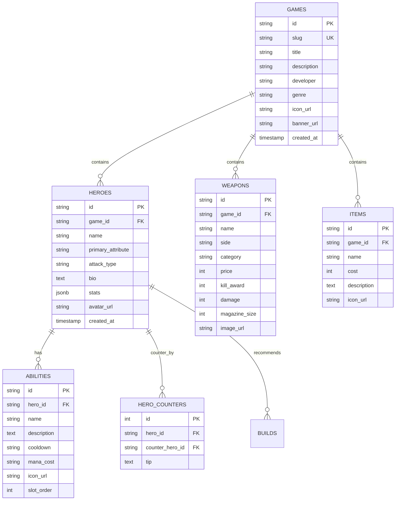

# Схема Бази Даних (ERD) - GameGuide

Документ для розробника **Бекенд (База даних)**.

## Діаграма зв'язків сутностей (Mermaid ERD)



## Пояснення полів JSONB в `HEROES.stats`
Для MOBA-ігор характеристики відрізняються, тому реляційне ядро доповнюється полем `stats` (JSONB у PostgreSQL або TEXT у SQLite):
```json
{
  "base_hp": 670,
  "base_mana": 267,
  "base_armor": 1.8,
  "movement_speed": 280,
  "attack_range": 150
}
```
