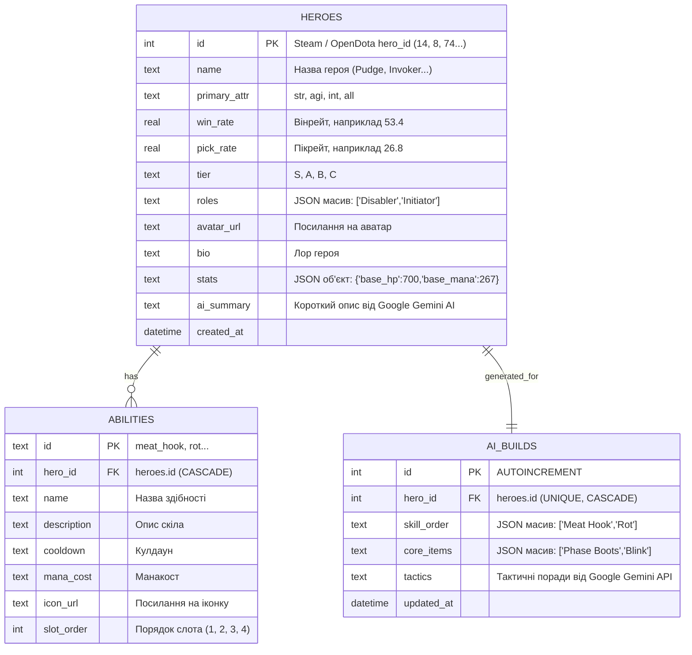

# Схема Бази Даних (SQLite ERD) - MangoData

База даних: **SQLite 3**  
Відповідальний: **Бекенд (База даних - YY)**

## Діаграма сутностей SQLite

## Особливості реалізації в SQLite:
1. Масиви та вкладені об'єкти (`roles`, `stats`, `skill_order`, `core_items`) зберігаються як валідні JSON-рядки у полях типу `TEXT`.
2. Увімкнення Foreign Keys у Shelf-сервері: перед виконанням запитів викликати `PRAGMA foreign_keys = ON;`.
